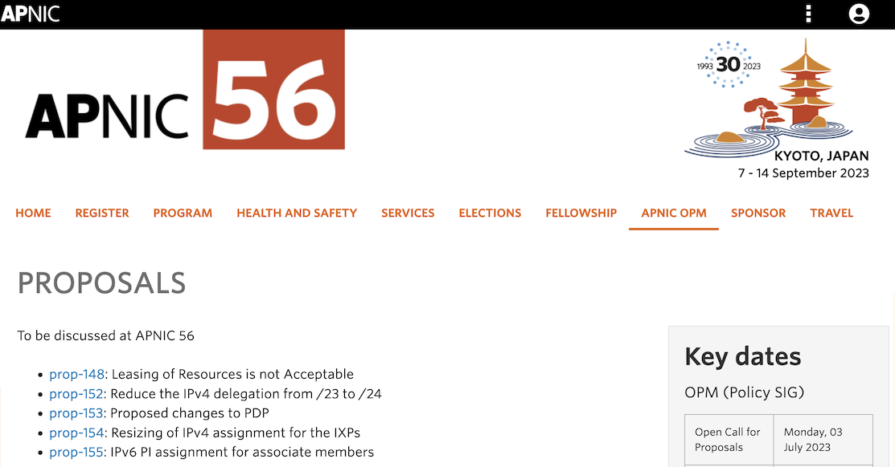

# APNIC56 を爆速で振り返る

## 慶應義塾大学/WIDE Project/NANOG 大谷亘 a.k.a. alt

2023/09/16 JSNOG-LT-2

※NANOG=NAndemonai Network Operators Group

---

# 自己紹介

- 名前: 大谷 亘 (Wataru "Alt" Ohgai)
- サイト: https://blog.jj1lfc.dev
- 所属:
  - 慶應義塾大学大学院 政策・メディア研究科 修士課程
  - WIDE Project
  - **NANOG** (NAndemonai NOG)
  - 某一般社団法人
- 興味
  - DNS
  - Email
  - Security

---

By-laws reform と OPM の内容に絞ってご紹介します

---

# By-laws reform

---

# 定款改定投票の経緯

- 設立以来初めて，会員の投票による定款の改定を行った
- APRICOT2023 での理事選挙について問題視する意見がコミュニティより多数寄せられた ([JPNIC Blog](https://blog.nic.ad.jp/2023/8613/) を参考)
  - 事務局を騙って特定候補への投票を促す会員宛の電話
  - 匿名の脅迫や選挙関連について沈黙することの要求など
  - 定款には不正を理由に候補の出馬を無効にできる規定がない
- 事務局が改定案を 5 つ作成し，各々について会員が投票を行った

---

# 改定案 1: 新しい理事候補適格条件の導入

- 現在の適格条件に加えて
  - APNIC 地域との関係性
  - APNIC 会議への出席状況
  - 定款・選挙手順に従うことの宣誓書提出 など
- 虚偽の申告が発覚した場合，選挙後でも理事権を剥奪できる

賛成率 92.5% で**可決**

---

# 改定案 2: 独立性と地理的代表性の確保

- 不適格とする条件の策定
  - APNIC/APNIC 財団の職員
  - APNIC コミュニティから選出された他の代表
  - 他の RIR や ICANN の職員・理事
- APNIC 地域の個人を年間 1 名まで選出できる

賛成率 87.4% で**可決**

---

# 改定案 3: APNIC への訴訟関係者を不適格に

- APNIC に対する訴訟を起こしている個人 (ないしは組織の関係者など) が理事になることを防ぐ
- APNIC に対する訴訟の関係者についてであり，APNIC が起こしている訴訟の関係者についてではない

賛成率 91.4% で**可決**

---

# 改定案 4: 単一組織・企業グループによる理事会支配の制限

- 「単一の会員組織からは 1 人のみ理事になれる」現行の制限を廃止
- 書類上の会員組織に限らず，例外を除く全ての組織について複数人擁立を制限
  - 理事指定の APNIC 関連非営利組織を例外とする
  - APNIC の活動に関係のない組織も例外とする

賛成率 92% で**可決**

---

# 改定案 5: 独立した選挙管理委員会の新設

- 理事候補の適格性を判断する
- 理事候補の行動規範を策定し遵守させる
- 選挙後であっても不適格な候補・行動規範を遵守しない候補を除外できる
- 選挙管理委員会による決定は覆せない

賛成率 91.9% で**可決**

---

# 全 5 案が可決

1. 新しい理事候補適格条件の導入
1. 独立性と地理的代表性の確保
1. APNIC への訴訟関係者を不適格に
1. 単一組織・企業グループによる理事会支配の制限
1. 独立した選挙管理委員会の新設

- 賛成率は概ね 9 割前後
- 1 割前後が反対または棄権している
  - 1 会員組織 1 票ではなく，規模に応じた投票権が適用されている

---

# Open Policy Forum での議論

---

# [prop-148](https://www.apnic.net/community/policy/proposals/prop-148/)

## Leasing of Resources is not Acceptable

現在のポリシでは IP アドレスの割当に直接接続を条件としているが，リースは明示的に禁止されていない．
提案者・APNIC ともに「リースは許容されるものでない」というスタンスだが，リース事業者は実在し，積極的に対応できていない．
リース禁止を明文化しようという提案．

---

# [prop-148](https://www.apnic.net/community/policy/proposals/prop-148/)

## Leasing of Resources is not Acceptable

(大変複雑な議論なため割愛)

**コンセンサスに至らず**: 新規提案として作り直すべきか?

---

# [prop-152](https://www.apnic.net/community/policy/proposals/prop-152/)

## Reduce the IPv4 delegation from /23 to /24

現在のポリシでは現行のアドレス在庫が枯渇した後に既存メンバには分配しないことになっている．
提案者は IPv6 実装のためにも IPv4 アドレスは必要だと考えている．
枯渇後は最大割当サイズを /24 に縮小し継続して再分配しようという提案．

---

# [prop-152](https://www.apnic.net/community/policy/proposals/prop-152/)

## Reduce the IPv4 delegation from /23 to /24

- もう IPv4 は死んだ．ポリシーは不要．
- 新規参入者の障壁になる

**コンセンサスに至らず**: メーリスでの議論へ

---

# [prop-153](https://www.apnic.net/community/policy/proposals/prop-153/)

## Proposed changes to PDP

現行の PDP では提案者が提案を Policy SIG チェアに提出後，Policy SIG チェアは OPM 4 週間前までにメーリスに投稿することになっているが，提案者がいつまでに Policy SIG チェアに提出するか期限が定まっていない．
この期限を OPM 5 週間前までと明示する提案．

---

# [prop-153](https://www.apnic.net/community/policy/proposals/prop-153/)

## Proposed changes to PDP

- もっと短くて良いのでは?
  - 日本などでは翻訳作業などに時間がかかる
  - JPOPF「タイムラインが決まっていれば間に合わせられる」

**コンセンサスに至らず**: 期間の見直しなどを検討

---

# [prop-154](https://www.apnic.net/community/policy/proposals/prop-154/)

## Resizing of IPv4 assignment for the IXPs

現行では IXP に /24 の割当を行っているが，事業規模によっては持て余すことがあるため，デフォルトの割当サイズを /26 に縮小する提案．
本提案では，ピアリング数に応じて /24 まで割当可，さらに利用率に応じて /22 までリナンバリングによって対応することとしている．

---

# [prop-154](https://www.apnic.net/community/policy/proposals/prop-154/)

## Resizing of IPv4 assignment for the IXPs

- もう IPv4 は死んだ
  - それでも IX にはまだ IPv4 がそれなりに必要なこともある
- それより IPv6 の議論にリソースを割くべきだ
- リナンバリングは大変な作業
- IX に必要サイズを計算・提出させて，最初から適切にサイジングするべきでは?
- そもそも IX は CGNAT のアドレスを使ったらいいのでは?
  - Global routable address という unique なアドレスが必要
- /26 しかもらえなくても /24 分の金を払うのか?
  - EC に料金を見直してもらう必要がある

**コンセンサスに至らず**: メーリスでの議論へ

---

# [prop-155](https://www.apnic.net/community/policy/proposals/prop-155/)

## IPv6 PI assignment for associate members

IPv4/IPv6 のどちらのアドレスも持たないアソシエイトメンバに対し，/48 の IPv6 アドレス割当を認める提案．

---

# [prop-155](https://www.apnic.net/community/policy/proposals/prop-155/)

## IPv6 PI assignment for associate members

- 特筆すべきコメント・異論は挙げられず

**コンセンサス形成**: AMM で議論 → コンセンサス形成 →last call へ

---

## 関連資料・備考

- By-laws reform について

  - [APNIC Bylaws - YouTube](https://www.youtube.com/live/SoA28_LEd_w)
  - [APNIC 理事選挙を振り返って ~ インターネットの基盤運営機構を守るために - JPNIC Blog](https://blog.nic.ad.jp/2023/8613/)

- OPM について
  - [Open Policy Meeting 1 - YouTube](https://www.youtube.com/live/tIvZdDY8rSI)
  - [APNIC Open Policy Meeting 2](https://www.youtube.com/live/4QBjDbJmRdc)
  - [APNIC 56 での IP アドレス・AS 番号分配ポリシーに関する提案のご紹介 - JPNIC Blog](https://blog.nic.ad.jp/2023/9196/)
  - [APNIC 56 に向けた意見交換ミーティング - JPOPF 運営チーム](https://www.jpopf.net/20230830announce?action=AttachFile&do=get&target=20230830-APNIC56%E3%83%9B%E3%82%9A%E3%83%AA%E3%82%B7%E3%83%BC%E6%8F%90%E6%A1%88%E6%84%8F%E8%A6%8B%E4%BA%A4%E6%8F%9B%E8%B3%87%E6%96%99.pdf)

**本カンファレンスには [JPNIC 国際会議参加支援プログラム](https://www.nic.ad.jp/ja/intl/fellowship-program/index.html)による支援を受けて参加しました**
