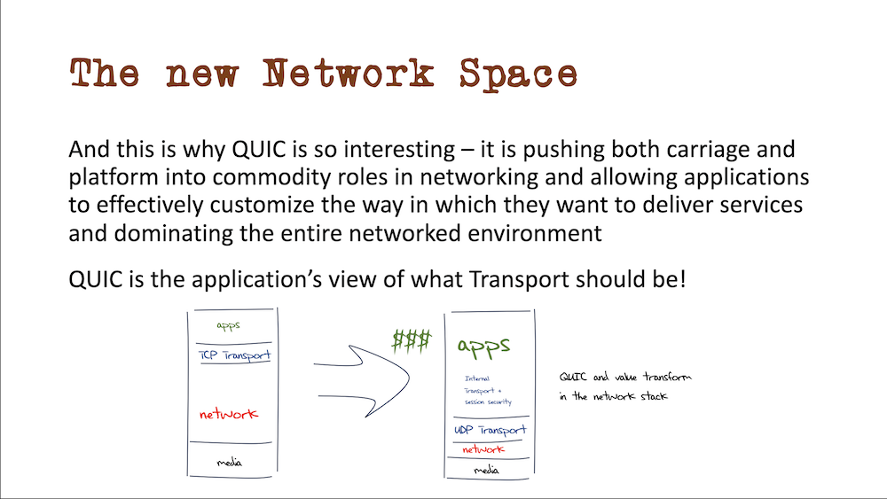

# APNIC56 参加報告

## 慶應義塾大学 大谷亘 alt@sfc.wide.ad.jp

2023/10/31 国際会議参加支援プログラム報告会

---

# 自己紹介

## 大谷亘 (Wataru Ohgai / alt)

- 慶應義塾大学大学院 政策・メディア研究科 M2
- 専門
  - DNS
  - Email
  - Security

---

# 参加したセッション - day1

- Newcomers welcome
- **Opening Ceremony and Keynotes**
- Technical 1
- **Technical 2**
- Welcome social

---

# 参加したセッション - day2

- **Technical 4 - JANOG**
- APNIC/FIRST/APCERT
- Lightning Talks
- Meet the EC Cocktail

---

# 参加したセッション - day3

- APNIC By-laws Reform
- Open Policy Meeting 1
- Open Policy Meeting 2
- APNIC Member Meeting 1
- APNIC Member Meeting 2
- Closing Social

---

# Opening Ceremony and Keynotes

- Welcome remarks
- Keynote speech
  - Jun Murai
  - Yosuke Kaneko

---

# Opening Ceremony and Keynotes

## Public Core Internet

※画像出典: [Zoom recording](https://apnic.zoom.us/rec/share/Y27Q63j_OfDzxLj1vQh9G4XazoGn-CwocwgOLC-iY4ZCr5VDTnuX6-o26qRH0TF0.DxiOohRiiqm7lQk4)

---

# Technical 2

- Starlink - insights after one year
- What is Interop Tokyo ShowNet? - Continuous Challenges over 30 years
- Goodbye TCP

---

# Technical 2

## Goodbye TCP

※画像出典:  
[APNIC56 Program](https://conference.apnic.net/56/assets/files/APJS642/2023-09-12-apnic-tcp_1694481341.pdf)

---

# Technical 4 - JANOG

- JANOG52 NW Team BAKUCHIKU - Overview of Network Construction
- Next-generation secure public Wi-Fi supporting the digital society and eduroam/OpenRoaming combined deployment in Cityroam
- Time dissemination service and relevant R&D in NICT, Japan

※画像出典: [APNIC Flickr](https://www.flickr.com/photos/apnic/53184599280/in/album-72177720311127255/) ([CC BY-NC-ND 2.0 Deed](https://creativecommons.org/licenses/by-nc-nd/2.0))

---

# 得られた経験と将来への展望

## 国内参加者との交流

- 日本開催のため日本人が多かった
- 国内の顔ぶれを知り人脈形成ができた

## RIR でのポリシ形成を知る

- OPM/AMM でのポリシ形成に参加
- [JSNOG にて発表・共有](https://slides.jj1lfc.dev/230916-jsnog-lt-2-alt)

---

# 得られた経験と将来への展望

- RIR/APNIC の役割に対する基礎的な理解
- コンセンサスメイキングなどの手法
- 持ち帰って役に立てる情報・知見

 

- 自コミュニティ内での報告
- 学んだ手法等の取り入れ
- 得たネットワークの有効活用
