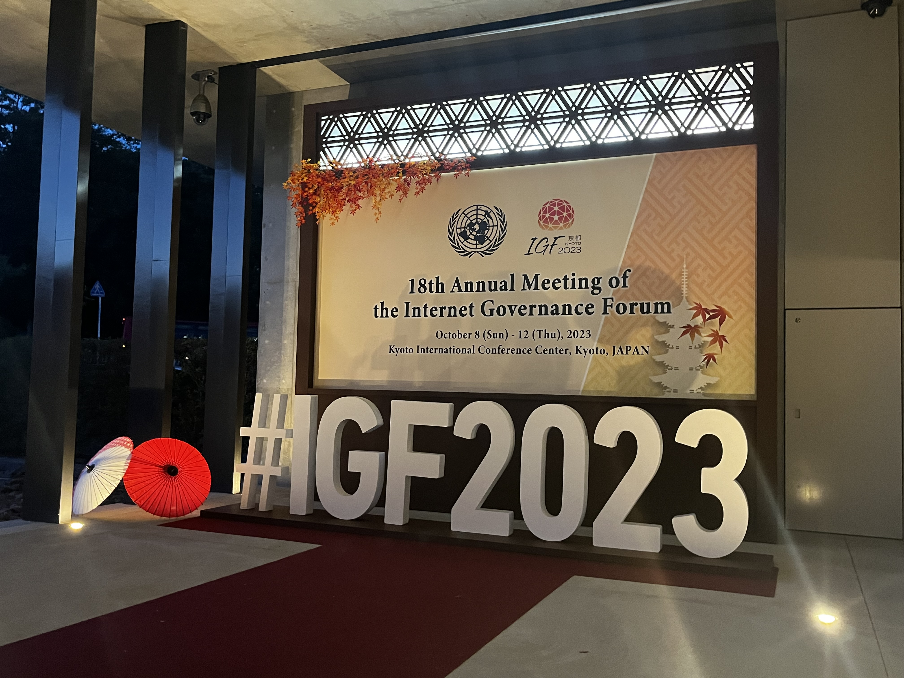
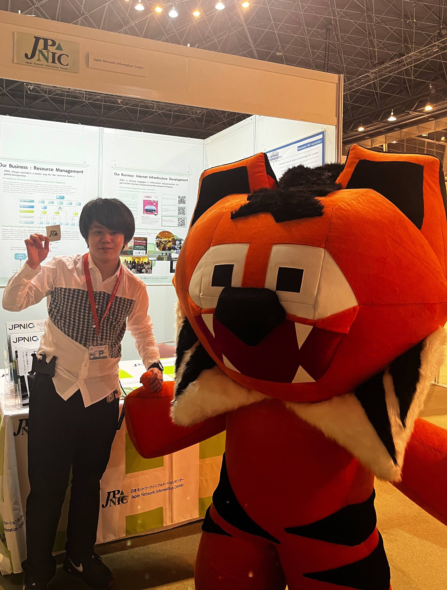
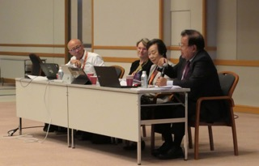

# IGF2023 参加報告

## 慶應義塾大学 大谷亘 alt@sfc.wide.ad.jp

2023/11/01
国際会議参加支援プログラム報告会

---

# 自己紹介

## 大谷亘 (Wataru Ohgai / alt)

- 慶應義塾大学大学院
  政策・メディア研究科 M2
- 専門
  - DNS
  - Email
  - Security

---

# 参加したセッション - 1

- Hack the Digital Divides
- Building Capacity in Cyber Security
- **Can a Layered Approach Stop Internet Fragmentation?**
- DC-DNSI Closing the Governance Gaps: New Paradigms for a Safer DNS
- **Manga Culture & Internet Governance–The Fight Against Piracy**

---

# 参加したセッション - 2

- What is the nature of the internet? Different Approaches
- YCIG Advancing Youth Participation in IG: results from case study
- **Internet Engineering Task Force Open Forum**
- Book presentation: “Youth Atlas (Second edition)”
- Open Mic – Taking Stock
- Closing Ceremony

---

# Can a Layered Approach Stop Internet Fragmentation?

OSI 参照モデルのようなアプローチでインターネット断片化を防ぐことはできるか?

- 上層で実施: 有効
- 下層で実施: 副作用の恐れ

---

# Manga Culture & Internet Governance – The Fight Against Piracy

- 実際のマンガ制作者によるプレゼンやマンガ文化自体の取り組みについて説明
- 会場からも読者として切実な声
- 正規の出版社によるプラットフォーム多言語対応が必要である

---

# Internet Engineering Task Force Open Forum

- IETF の概要，インターネットにおける役割の説明
- open, bottom-up, rough consensus
- 多様性への対応状況
- non-tech からの QA など

---

# 得られた経験と将来への展望

## 海外 Youth との交流

- ISOC YSG と協力し Youth Social Event を開催
- 多くの海外 Youth と自分の専門やそれ以外について話したり，協力しながらイベントを作る経験ができた
- 各々のセッションよりもここでできたネットワークが重要かもしれない

---

# 得られた経験と将来への展望

## 他会議との違い

- ICANN, RIR, IETF ... との違い
- IGF は特に「意思決定」ではなく「対話のためのプラットフォーム」
  →「他のステークホルダの視点を学ぶ」つもりで参加
- トップダウンを前提とする対話が多く感じられた
- 文化の違いを認識し，non-govt., tech-community としてどうアプローチできるか
