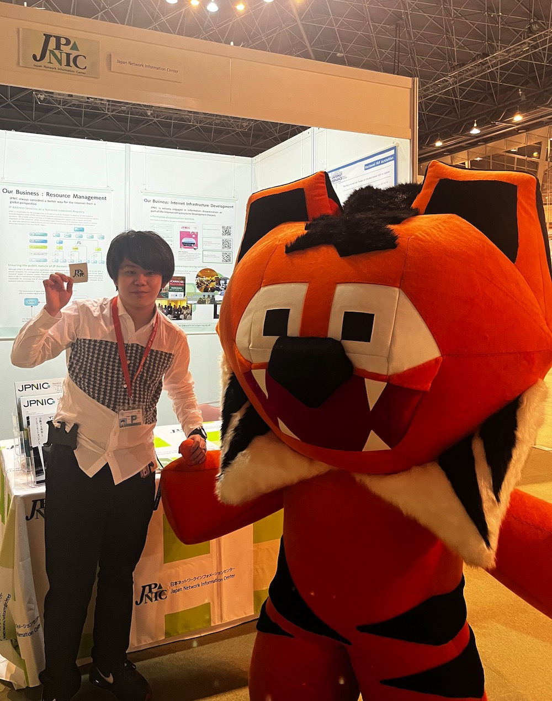
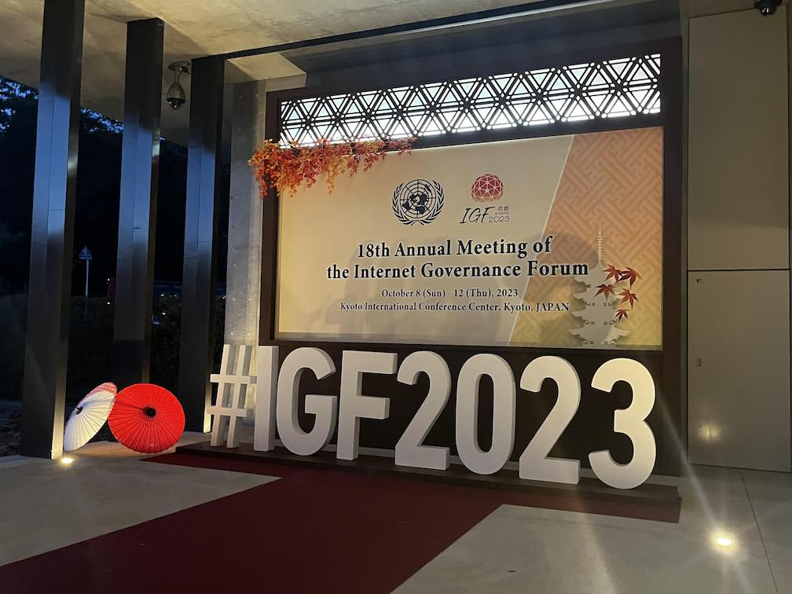
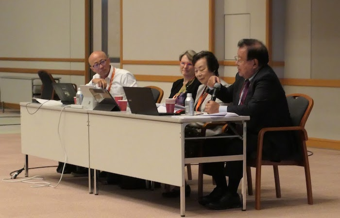

# IGF2023 フェローシップ体験談

## 慶應義塾大学 大谷亘 \<<alt@jj1lfc.dev>\>

2023/11/29 JPOPM45

---

# 自己紹介

## 大谷亘 (Wataru "Alt" Ohgai)

- 慶應義塾大学大学院
  政策・メディア研究科 M2
- 専門
  - DNS
  - Email
  - Security

---

# IGF2023 概要

- 日時: 2023/10/8 (日)-12 (木)
- 場所: 国立京都国際会館
- 参加者: 9,279 人以上
  - 現地参加 6,279 人
  - オンライン 3,000+ 人
- 会合: 355 セッション
- メインテーマ:
  "The Internet We Want - Empowering All People"

---

# 参加セッション紹介

## Can a Layered Approach Stop Internet Fragmentation?

OSI 参照モデルのようなアプローチでインターネット断片化を防ぐことはできるか?

- 上層で実施: 有効
- 下層で実施: 副作用の恐れ

---

# 参加セッション紹介

## Manga Culture & Internet Governance – The Fight Against Piracy

- 実際のマンガ制作者によるプレゼンやマンガ文化自体の取り組みについて説明
- 会場からも読者として切実な声
- 正規の出版社によるプラットフォーム多言語対応が必要である

---

# 参加セッション紹介

## Internet Engineering Task Force Open Forum

- IETF の概要，インターネットにおける役割の説明
- open, bottom-up, rough consensus
- 多様性への対応状況
- non-tech からの QA など

---

# 得られた経験と将来への展望

## 海外 Youth との交流

- ISOC YSG と協力し Youth Social Event を開催
- 多くの海外 Youth と自分の専門やそれ以外について話したり，協力しながらイベントを作る経験ができた
- 各々のセッションよりもここでできたネットワークが重要かもしれない

---

# 得られた経験と将来への展望

## 他会議との違い

- ICANN, RIR, IETF ... との違い
- IGF は特に「意思決定」ではなく「対話のためのプラットフォーム」
  →「他のステークホルダの視点を学ぶ」つもりで参加
- トップダウンを前提とする対話が多く感じられた
- 文化の違いを認識し，non-govt., tech-community としてどうアプローチできるか

---

# Reference

- [Draft IGF 2023 Summary](https://www.intgovforum.org/en/filedepot_download/300/26575) (UN)
- [総務省｜報道資料｜インターネット・ガバナンス・フォーラム京都 2023 の開催結果](https://www.soumu.go.jp/menu_news/s-news/01tsushin06_02000280.html)
- [インターネット・ガバナンス・フォーラム京都２０２３](https://www.soumu.go.jp/igfkyoto2023/) (MIC)
- [IGF 京都 2023 フォトレポート – JPNIC Blog](https://blog.nic.ad.jp/2023/9306/)
