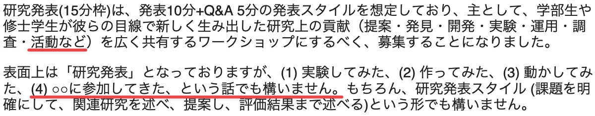

# いろんなインターネット会議に出てみる

## 慶應義塾大学 大谷亘 \<<alt@sfc.wide.ad.jp>\>

2023/12/23 WIDE 研究会

---

# Disclaimer

(出典: [WIDE 研究会(2023.12) 研究発表 (15 分枠) 応募フォーム](https://docs.google.com/forms/d/e/1FAIpQLSfPz3Te6__Iodx0G-mSOLUY1BcdHSTLS4YAQLMH77PpxVRjgA/viewform))

---

# 本発表の目的

- 個人的な活動の wrap-up
- tech な / tech の関与が必要な 議論母体を若者に紹介
- (どの分野であれ) グローバルに活躍するきっかけに……
- 一緒に多角的にインターネットを作り動かすきっかけに……

---

# 今年出てみたインターネット会議

## オンサイト

- ICANN76 (メキシコ)
- IETF116 (横浜)
- APNIC56 (京都)
- IGF2023 (京都)

## オンライン

- ICANN77
- ICANN78
- IETF117
- IETF118

---

# ICANN: とは

[Internet Corporation for Assigned Names and Numbers](https://www.icann.org/en/beginners):
グローバルな資源管理・それに伴うポリシーの策定・実装を行う組織
(資源: ASN, IP Address, Protocol Parameter, Domain Name)

- 年 3 回ハイブリッド
  - Community Forum
  - Policy Forum
  - Annual General Meeting
- Tech:Policy = 4:6 (個人の感想)

- 基本全部無料
- 様々な[部会](https://www.icann.org/en/beginners/find-your-icann-group)で活動
- Newcomer 向けプログラムが豊富
  - [ICANN Fellowship Program](https://www.icann.org/fellowshipprogram)
  - [NextGen@ICANN Program](https://www.icann.org/public-responsibility-support/nextgen)

---

# ICANN: 得られるもの・できること

- わかる
  - Inclusive の概念
  - Multistakeholder の概念
  - Internet Governance の世界
  - 技術屋としての関わり方
  - 何が Internet で問題となっているのか

- できる

  - 技術屋としての助言
  - 具体的には部会への参加

- Read more...
  - [おるとブログ](https://blog.jj1lfc.dev/posts/icann76-ietf116/)
  - [今のお仕事](https://blog.nic.ad.jp/2023/8983/)
  - [ICANN77 Newsletter](https://myemail.constantcontact.com/Read-Today-s-Session-Highlights-and-More-in-the-ICANN77-Newsletter.html)
  - [ICANN76 参加報告](https://www.nic.ad.jp/ja/materials/fellowship-report/icann76-report-ohgai.pdf)/[スライド](https://slides.jj1lfc.dev/ICANN76-report-ppt.pdf)

---

# IETF: とは

[Internet Engineering Task Force](https://www.ietf.org/): インターネットで使われる技術標準を策定する組織

- 年 3 回ハイブリッド
  - **ML 上で継続的に議論**
  - WG などによって Interim meeting も
- Tech:Policy = 9.5:0.5 (個人の感想)
- 基本 [WG](https://datatracker.ietf.org/wg/) ベースで活動

- Meeting 参加は有料
  - 学割あり
  - オンラインは安い
  - ハッカソンのみはタダ
- 4/6 回目まで [newcomer](https://www.ietf.org/how/meetings/new-participants/) 扱い
  - 新人向けセッション
  - [IETF Guides](https://www.ietf.org/about/participate/guides/)

---

# IETF: 得られるもの・できること

\*\*議論はメーリスの続き・メーリスを読んでいることが前提\*\*

- わかる
  - "We reject kings, ..."
  - Open, Bottom up, Rough consensus
  - 最新の技術動向
  - 誰が技術を作っているか

- できる

  - 自分の考えをトップ研究者と議論
  - インターネット標準の策定

- Read more...
  - [IETF116 発表アーカイブ](https://youtu.be/dWRS_Z2CsMQ?t=672)
  - [IETF116 発表スライド](https://slides.jj1lfc.dev/M2DMRT-IETF116.pdf)

---

# APNIC: とは

[Asia Pacific Network Information Centre](https://www.apnic.net/): アジア太平洋地域を管轄する RIR
RIR: ICANN から分割された地域ごとの資源管理を行う組織

- 年 2 回ハイブリッド
  - 春: APRICOT / APNIC Conference
  - 秋: APNIC Conference
- Tech:Policy = 5:5 (個人の感想)
- Meeting 参加は有料

- 内容
  - ワークショップ
  - ポリシーミーティング
  - 新人向けセッション (一応)
  - (peering personals)

---

# APNIC: 得られるもの・できること

- わかる
  - インターネット資源運用の現場
  - 特にアドレス・ASN のポリシー
  - ニーズとポリシーの必要性
  - その地域における事業の特色
  - [~~地政学的なゴタゴタ~~](https://www.janog.gr.jp/meeting/janog53/nl-robust/)

- できる
  - ポリシー策定に参加
  - 地域の人々と繋がる
- Read more...
  - [APNIC56 参加報告書](https://www.nic.ad.jp/ja/materials/fellowship-report/apnic56-ohtani-1.pdf)
  - [APNIC56 参加報告スライド](https://slides.jj1lfc.dev/231031-apnic56-report-alt)

---

# IGF: とは

[Interget Governance Forum](https://www.intgovforum.org/en):
国連が主催するサイバー社会に関するマルチステークホルダな \*\*対話\*\* の場

- 年 1 回ハイブリッド
  - 2025 年までを予定 (WSIS+20)
- Tech:Policy = 1:9 (個人の感想)
- Meeting 参加は無料
- Governance of/on the Internet

- 内容
  - ワークショップ
  - オープンダイアログ
  - ハイレベル/パーラメンタリ
  - etc...

---

# IGF: 得られるもの・できること

- わかる
  - 他会議には出てこない広い層の視点
  - より広い視点から見た tech-community の立ち位置
  - Governance **on** the Internet
  - "我々" の思う multistakeholder
  - 広範な現実世界を動かすヒント

- できる
  - 主体的な Youth の輪
  - 現実世界のメジャープレイヤーとの対等な対話
- Read more...
  - [IGF2023 参加報告書](https://www.nic.ad.jp/ja/materials/fellowship-report/igf2023-ohgai-1.pdf)
  - [IGF2023 参加報告スライド](https://slides.jj1lfc.dev/231101-IGF2023-report-alt)
  - [参加報告@JPOPM45](https://slides.jj1lfc.dev/231129-JPOPM45-IGF2023-alt)

---

# 若者が外の世界に出るに当たって

- 自分が貢献できる世界を広げる
  - 技術の専門を生かして
  - 技術以外の専門を見つける
- 目的意識を持って参加する
  - 単発観光旅行で終わらせない
- [継続的なエンゲージメント](https://www.janog.gr.jp/meeting/janog53/ietf/)
  - 単発観光旅行で終わらせない
- 💰💰💰💰💰💰
  - ~~うまく大人を言いくるめる~~
    アピールの仕方を学ぶ

https://memeguy.com/photo/471258/my-english-skills

