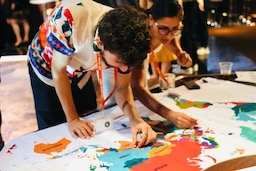

# フェローとして IGF2023 に参加して

## 慶應義塾大学 大谷亘 \<<alt@jj1lfc.dev>\>

2023/12/26 IGF 2023 報告会

---

# 自己紹介

## 大谷亘 (Wataru "Alt" Ohgai)

- 慶應義塾大学大学院
  政策・メディア研究科 M2
- JPNIC IGF 2023 フェロー
- 専門 - tech side
  - DNS
  - Email
  - Security

---

# 得られた経験と将来への展望

## 海外 Youth との交流

- ISOC YSG と協力し Youth Social Event を開催
- 多くの海外 Youth と自分の専門やそれ以外について話したり，協力しながらイベントを作る経験ができた
- 今回は各々のセッションよりもここでできたネットワークが重要かもしれない

---

## ISOC Youth SG

[Youth Atlas 2nd edit.](https://bit.ly/atlas2)

[Youth Social Event](https://youthsig.org/igf2023-social-event/)

---

# 得られた経験と将来への展望

## 他会議との違い

- ICANN, RIR, IETF ... との違い
- IGF は特に「意思決定」ではなく「対話のためのプラットフォーム」
  →「他のステークホルダの視点を学ぶ」つもりで参加
- 文化の違いを認識し，non-govt., tech-community としてどうアプローチできるか

---

# 得られた経験と将来への展望

## 継続的なエンゲージメント

- IGF におけるエンゲージメント
  - Tech Community として
  - Youth として
- IG 分野全体へのエンゲージメント
  - 所属・議論母体を超えたつながり
  - 「聴く」「学ぶ」から「貢献する」「発信する」へ

---

# Reference

- [Draft IGF 2023 Summary](https://www.intgovforum.org/en/filedepot_download/300/26575) (UN)
- [総務省｜報道資料｜インターネット・ガバナンス・フォーラム京都 2023 の開催結果](https://www.soumu.go.jp/menu_news/s-news/01tsushin06_02000280.html)
- [インターネット・ガバナンス・フォーラム京都２０２３](https://www.soumu.go.jp/igfkyoto2023/) (MIC)
- [IGF 京都 2023 フォトレポート – JPNIC Blog](https://blog.nic.ad.jp/2023/9306/)
- [IGF 2023 参加報告書](https://www.nic.ad.jp/ja/materials/fellowship-report/igf2023-ohgai-1.pdf)
