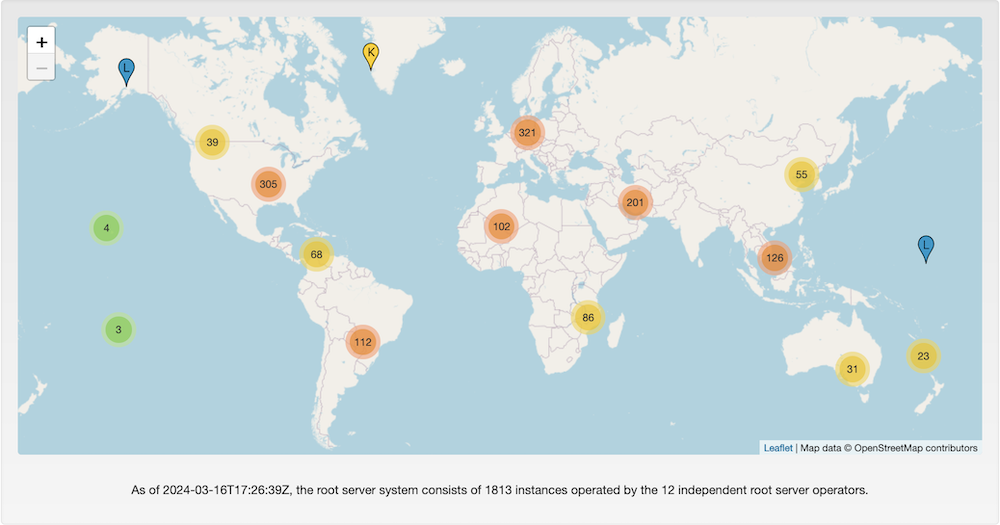
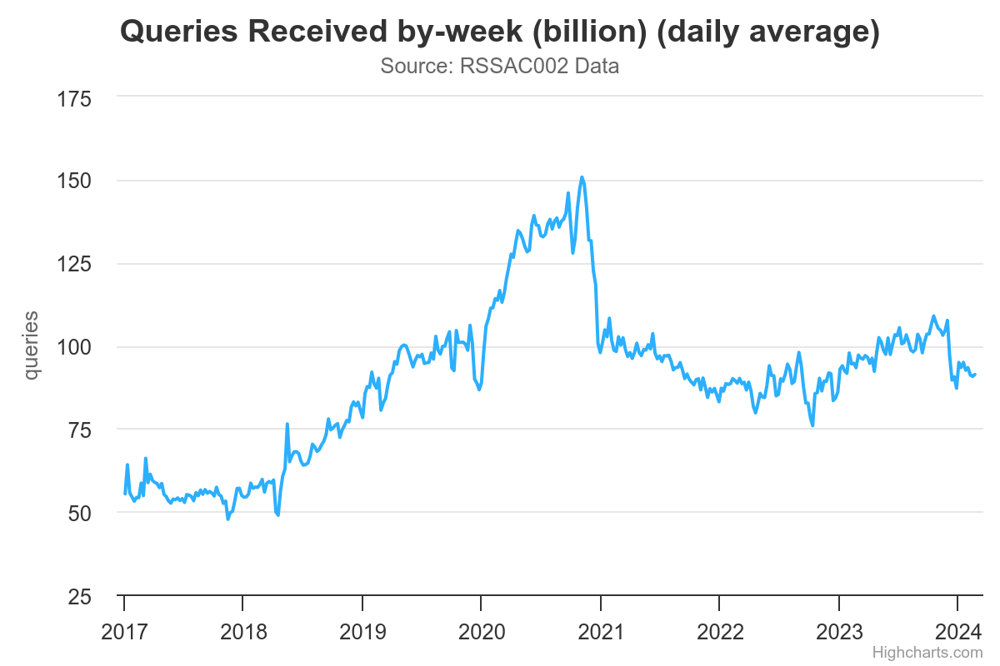
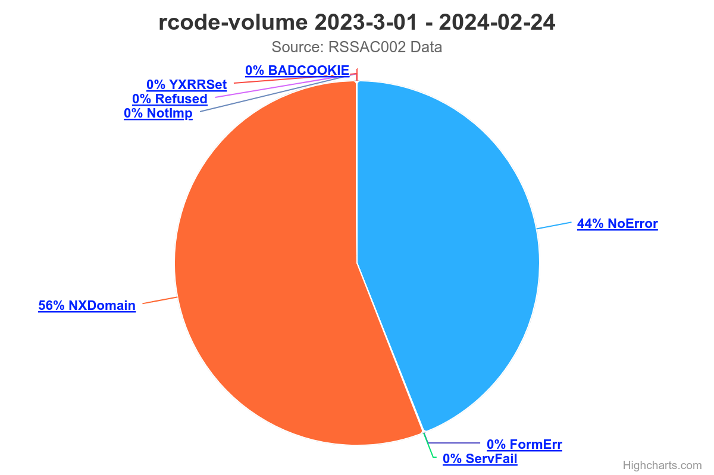
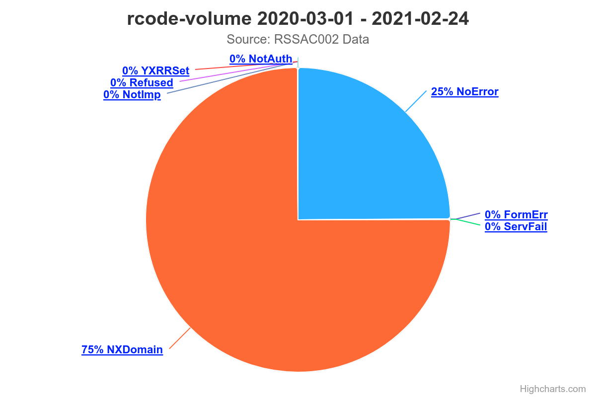
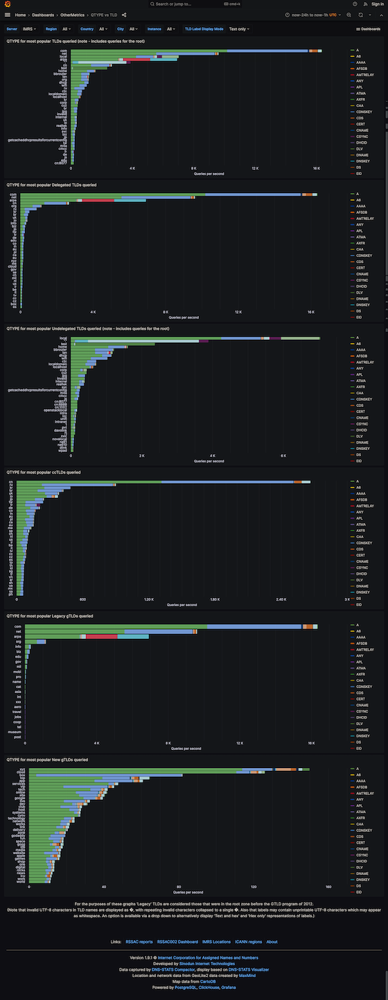
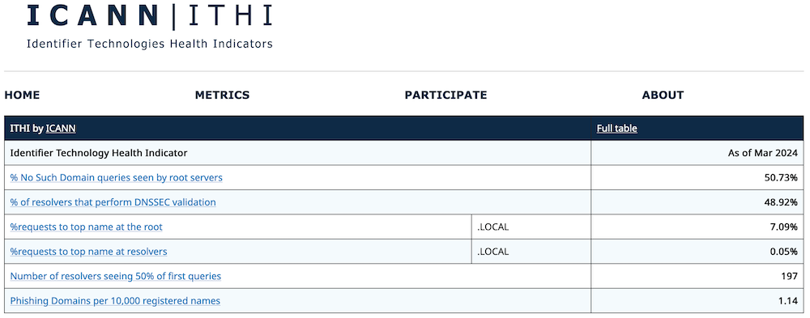
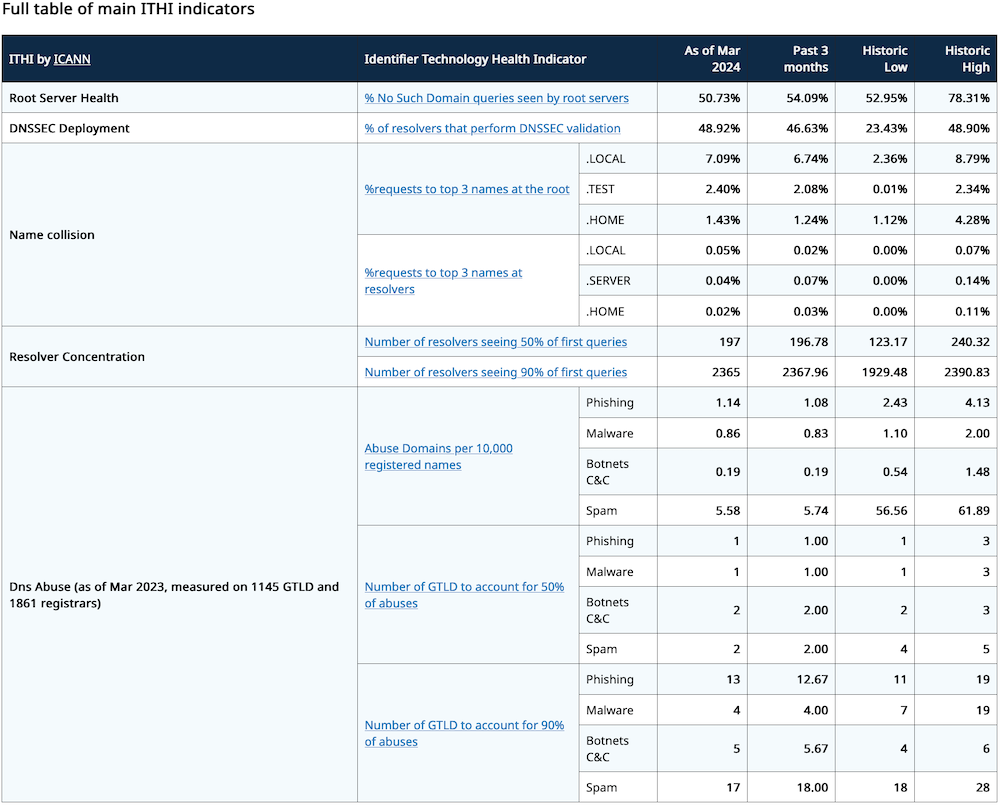
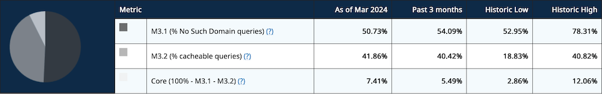
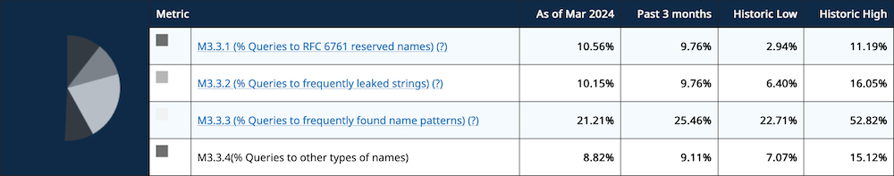
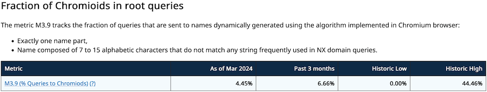

# データで見る RSS (Root Server System)

## 大谷亘 (alt)

2024/03/17 JSNOG-LT-3

---

# 自己紹介

- 名前: 大谷 亘 (Wataru "Alt" Ohgai)
- サイト: https://blog.jj1lfc.dev
- 所属: ※本発表は個人の見解に基づきます
  - (慶應義塾大学大学院 政策・メディア研究科 修士課程)
  - 某 NIR
  - RSSAC Caucus
- 興味
  - DNS
  - Email
  - Security

---

# ICANN / RSSAC / RSSAC Caucus

- [ICANN](https://www.icann.org): インターネット資源を管理するためのグローバルコミュニティ
  - インターネット資源
    - 番号資源 (IP アドレス・AS 番号)
    - ドメイン名
    - プロトコルパラメータ
- [RSSAC](https://www.icann.org/groups/rssac): RSS の運用について ICANN 理事会やコミュニティに助言を行う
  - 主に RSO の担当者とリエゾンで構成される
- [RSSAC Caucus](https://www.icann.org/groups/rssac-caucus)
  - RSSAC の要請に基づきポリシーの詳細な検討・調査・文書化を行う実働部隊

---

---

# RSS 関連のデータは結構公開されている

- [Root Files | IANA](https://www.iana.org/domains/root/files): ルートゾーンファイル・DNSSEC 公開鍵など (今回は省略)
- [root-servers.org](https://root-servers.org/): RSO のサイト
- [RSSAC002](https://rssac002.root-servers.org/): ルートサーバの基本メトリクス
- [stats.dns.icann.org](https://stats.dns.icann.org/stats): L-root の詳細なメトリクス
- [ITHI Dashboard](https://ithi.research.icann.org/): ICANN OCTO のプロジェクト
- [RIPE Atlas - RIPE Network Coordination Centre](https://atlas.ripe.net/): (今回は省略)

---

# root-servers.org

- ルートサーバのインスタンス数，RSO ごとのサイトの場所が公開されている
- 本日 0000JST 時点で 1813 インスタンスが稼働中

---

# RSSAC002 Data

- [RSSAC002v4](https://www.icann.org/en/system/files/files/rssac-002-measurements-root-12mar20-en.pdf) で RSO が計測すべきメトリクスを定義している
  - 送受信クエリ数
  - 送信元 IP アドレス数
  - RCODE 毎の割合
  - ロードタイム
  - パケットサイズ などなど...
- 生データを各 RSO のページで公開，[root-servers.org 内](https://root-servers.org/rssac002/)にリンク
- グラフ化したものを rssac002.root-servers.org で公開

---

# RSSAC002 Data

受信クエリ数

- だいたい 750-1000 億クエリ/週
- 2020 年に急増し 2021 年に急減
  - [Chromium の実装が原因](https://gigazine.net/news/20200827-google-chrome-omnibox-root-dns/)
- 漸増傾向

---

# RSSAC002 Data

RCODE の割合

- NOERROR は 44% しかない
- NXDOMAIN (=ゴミ) が 56%

---

# RSSAC002 Data

ちなみに: 2020 年ごろのデータ

- NOERROR: 25%
- NXDOMAIN: 75%

---

# stats.dns.icann.org

- L-root (ICANN) の詳細なメトリクス
  - RSSAC002 定義のメトリクス
  - L-root のロケーション
  - インスタンス・設置都市ごとの
    メトリクス
  - クライアントの国・都市・サブネット などなど...
- Grafana で提供されている

---

## IMRS

- L-root インスタンスの一部は ICANN Managed Root Server と呼ばれる
- ICANN と世界のネットワークオペレータ達が共同で運用
- 本日 0000JST 時点で 75 の国と地域にて 165 インスタンスが運用中

---

# ITHI Project

ICANN OCTO の Identifier Technologies Helth Indicators Project

- ドメイン名や IP アドレスなどの「健康度」を継続的に計測・記録
- ルートサーバを含む 13 カテゴリのメトリクス
- [詳細解説記事](https://blog.nic.ad.jp/2023/9372/)書いたので読んでね

---

# ITHI Project

主要なメトリクス

---

## ITHI Project - M3 Metrics

---

## ITHI Project - frequently leaked names の例

- private domain
  - `HOME`
  - `LAN`
  - `INTERNAL` (※[SAC113](https://blog.nic.ad.jp/2023/9261/))
  - `LOCALDOMAIN`
  - `INTRA`
  - `WORKGROUP`

- 特定言語・実装・ベンダ依存?
  - `REALTEK`
  - `UNIFI`
  - `OPENSTACKLOCAL`
  - `K8S`
  - `DLINK`
  - `PHP`
  - `TOTOLINK`

---

## ITHI Project - Chromium によるリーク

- 過去最大で 44.46%
- 現在は 4.45% まで減少

---

# RSS 関連で参加できるプロジェクト

- [RIPE Atlas - RIPE Network Coordination Centre](https://atlas.ripe.net/)
  - 物理プローブは在庫がないけど [VM なら秒で建てられる](https://atlas.ripe.net/docs/howtos/software-probes.html)
- [AS112 Project](https://www.as112.net/)
  - AS 運用者向け
- [LocalRoot - USC/ISI](https://localroot.isi.edu/)
  - [RFC8806](https://datatracker.ietf.org/doc/html/rfc8806) も参照

---

# その他の参考資料

- [RSSAC000v8: RSSAC Operational Procedures](https://www.icann.org/en/system/files/files/rssac-000-op-procedures-15jan24-en.pdf)
- [OCTO-010: Brief Overview of the Root Server System](https://www.icann.org/en/system/files/files/octo-010-06may20-en.pdf)
- [RSSAC023v2: History of the Root Server System](https://www.icann.org/en/system/files/files/rssac-023-17jun20-en.pdf)
